<br><br>

## 🥬 목차

- [1️⃣ 서비스 소개](#-서비스-소개)
- [2️⃣ 팀원 소개](#-팀원-소개)
- [3️⃣ 기술 스택](#-기술-스택)
- [4️⃣ 시스템 아키텍처](#-시스템-아키텍처)
- [5️⃣ 참고 자료](#-참고-자료)
- [6️⃣ 로컬 개발 환경 설정](#-로컬-개발-환경-설정)
- [7️⃣ 개발 규칙](#-개발-규칙)

<br><br>

## 🥬 서비스 소개
### OCR 기반 영수증 스캔을 통한 효율적인 식자재 관리 웹 서비스

- 🕜 **진행 기간** : 2025.01.13. ~ 2025.02.21. (6주)
- 👨‍👩‍👧‍👦 **진행 인원** : 6명 (FE: 3, BE: 3)


<br>

<details>
  <summary><b>📱 영수증 OCR 기술을 통한 식자재 등록 간편화</b></summary>
  <ul>
    <li>영수증을 촬영하고 업로드하면 AI가 식자재를 분류하고 등록해줘요.</li>
  </ul>
  <br>
  <div>
    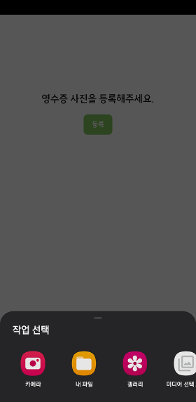
    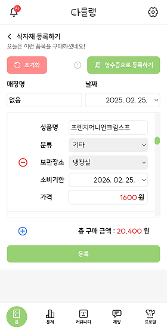
    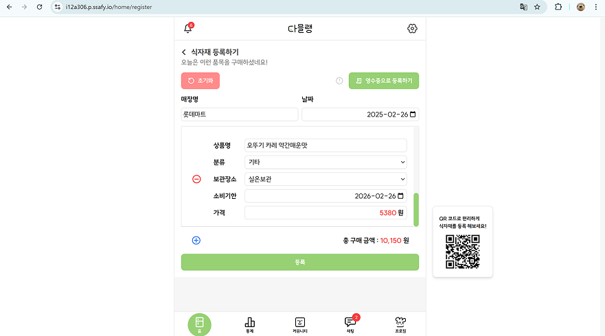
  </div>
</details>

<details>
  <summary><b>🍎 등록 식자재 재고 관리 및 레시피 추천</b></summary>
  <ul>
    <li>냉장고에 등록한 식자재들의 정보를 확인하고, 유통기한 알림을 받으며 효율적으로 관리할 수 있어요.</li>
    <li>등록된 식자재를 기반으로 레시피를 추천받을 수 있어요.</li>
  </ul>
  <br>
  <div>
    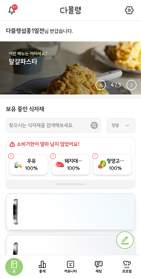
    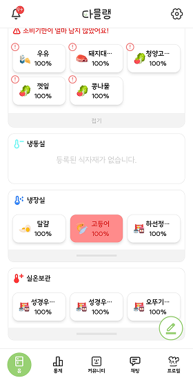
    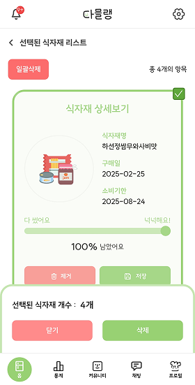
  </div>
</details>

<details>
  <summary><b>📝 나만의 레시피 공유 커뮤니티</b></summary>
  <ul>
    <li>나만의 요리 레시피를 공유하고, 다양한 사람들과 소통할 수 있어요.</li>
  </ul>
  <br>
  <div>
    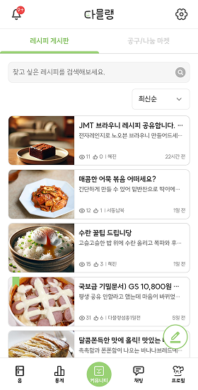
    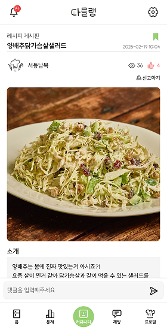
    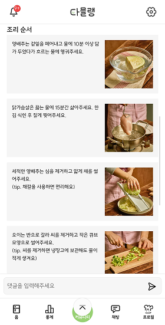
    
  </div>
</details>


<details>
  <summary><b>👥 식자재 나눔/공동구매 커뮤니티</b></summary>
  <ul>
    <li>남는 식자재를 나눠주거나 공동구매하고, 다양한 사람들과 소통할 수 있어요.</li>
  </ul>
  <br>
  <div>
    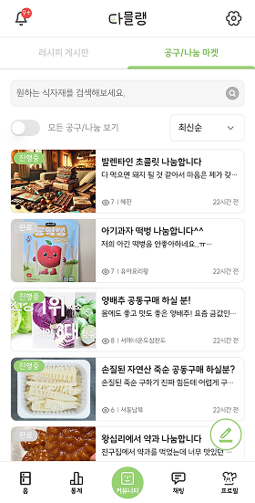
    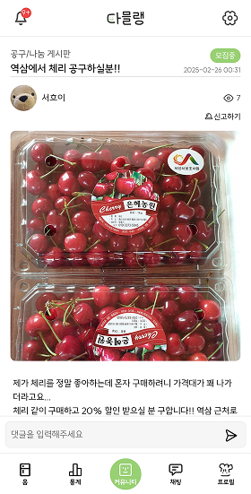
    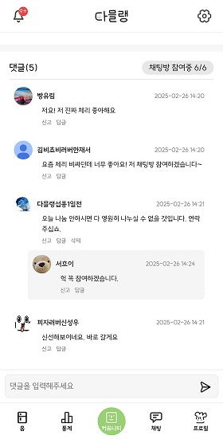
  </div>
</details>

<details>
  <summary><b>🧊 SNS 서비스</b></summary>
  <ul>
    <li>다른 유저의 선호 식자재, 획득 뱃지, 작성한 레시피, 냉장고 속 식자재 등을 열람할 수 있어요.
  </ul>
  <br>
  <div>
    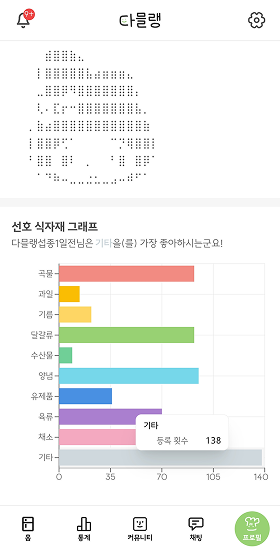
    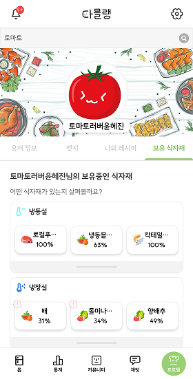
    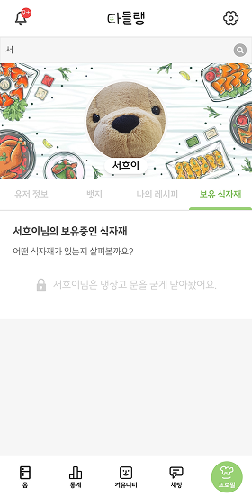
  </div>
</details>

<details>
  <summary><b>📊 식자재 시세 추이</b></summary>
  <ul>
  <li>식자재의 가격 변동을 그래프로 살펴보며 최적의 구매 시점을 찾아보세요.</li>
  <li>월별 구매 내역을 살펴보고 스마트 영수증을 열람할 수 있어요.</li>
  </ul>
  <br>
  <div>
    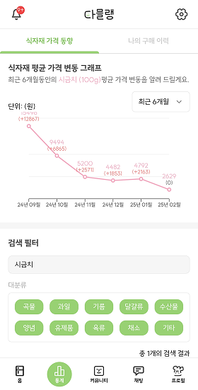
    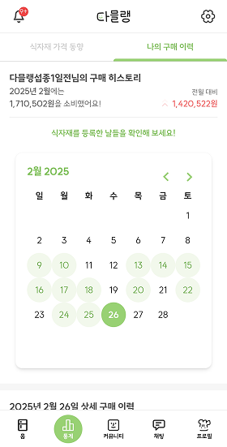
    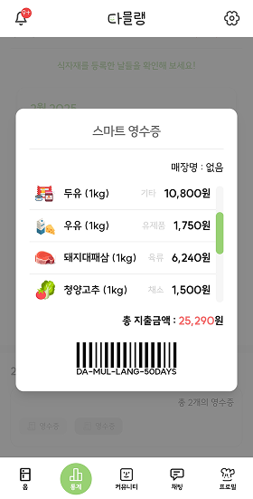
  </div>
</details>

<details>
  <summary><b>🛡️ 악성 유저 관리 기능</b></summary>
  <ul>
    <li>신고 시스템을 통해 건전한 사용 환경을 유지하고 있어요.</li>
  </ul>
  <br>
  <div>
    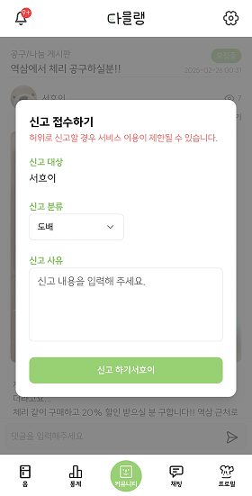
  </div>
</details>

<br><br>

## 🥬 팀원 소개
<table>
  <tr>
    <td align="center"><a href="https://github.com/Seoheeda"><br /><b>윤서희</b></a><br />👑총괄 팀장<br/><a href="https://github.com/Seoheeda"></a></td>
    <td align="center"><a href="https://github.com/jinlaove17"><br /><b>전종우</b></a><br />👑FE 팀장<br/><a href="https://github.com/jinlaove17"></a></td>
    <td align="center"><a href="https://github.com/rpeowiqu"><br /><b>한재서</b></a><br />👑BE 팀장<br/><a href="https://github.com/rpeowiqu"></a></td>
    <td align="center"><a href="https://github.com/gggwww06"><br /><b>윤혜진</b></a><br />👽BE 팀원<br/><a href="https://github.com/gggwww06"></a></td>
     <td align="center"><a href="https://github.com/deongGu"><br /><b>신성우</b></a><br />🔨FE 개발<br/><a href="https://github.com/deongGu/"></a></td>
      <td align="center"><a href="https://github.com/zyu22"><br /><b>지유림</b></a><br />🫠BE 개발<br/><a href="https://github.com/zyu22"></a></td>
  </tr>
</table>

<br><br>

## 🥬 기술 스택

<table>
<tr>
    <td align="center">프론트엔드</td>
    <td>
      
      
      
      
      
    </td>
  </tr>
  <tr>
    <td align="center">백엔드</td>
    <td>
      
      
      
      
      
    </td>
  </tr>
  <tr>
    <td align="center">데이터베이스</td>
    <td>
      
      
    </td>
  </tr>
  <tr>
    <td align="center">인프라</td>
    <td>
      
      
      
      
    </td>
  </tr>
  <tr>
    <td align="center">AI/ML</td>
    <td>
      
      
      
    </td>
  </tr>
  <tr>
    <td align="center">기획/디자인</td>
    <td>
      
      
      
    </td>
  </tr>
</table>

<br><br>

## 🥬 시스템 아키텍처


<br><br>

## 🥬 참고 자료

### 시연 영상
[](https://youtu.be/H0AKeinBATQ)

<br>

### ERD


<br>

[📜 요구사항 명세서](https://docs.google.com/spreadsheets/d/1wAX1XvWqnBKFOpOqtinnu7M4bim6Tqx1Ht1flq51Y0Q/edit?gid=0#gid=0)

[📜 기능 명세서](https://steel-nitrogen-087.notion.site/16f2ee0a14af80a28306face4fad83af)

[📜 플로우차트](https://www.figma.com/board/fxO9YRTF6e8eku8htajxwn/%ED%94%8C%EB%A1%9C%EC%9A%B0%EC%B0%A8%ED%8A%B8)

[📜 와이어프레임](https://www.figma.com/design/grtQIv1n5nbqhkAWOyXBkd/%EB%94%94%EC%9E%90%EC%9D%B8%26%EB%AA%A9%EC%97%85?node-id=105-7941&p=f)

[📜 산출물 스크린샷](https://www.figma.com/design/grtQIv1n5nbqhkAWOyXBkd/%EB%94%94%EC%9E%90%EC%9D%B8-%EB%AA%A9%EC%97%85?node-id=99-7667)

<br><br>

## 🥬 로컬 개발 환경 설정

### 필수 요구사항
```
- JDK 17
- Vite
- Gradle
- MariaDB
- Docker
```

<br><br>

## 🥬 개발 규칙

### Git 브랜치 전략
```
main (배포용)
├── Server
│   ├── server-develop (서버 개발용)
│   │   ├── feat/* (기능 개발)
│   │   └── fix/* (버그 수정)
│   └── ...
└── Client
    ├── client-develop (클라이언트 개발용)
    │   ├── feat/* (기능 개발)
    │   └── fix/* (버그 수정)
    └── ...
```

### 커밋 메시지
| 커밋 유형 | 의미 |
| --- | --- |
| `Feat` | 새로운 기능 추가 |
| `Fix` | 버그 수정 |
| `Docs` | 문서 수정 |
| `Style` | 코드 formatting, 세미콜론 누락, 코드 자체의 변경이 없는 경우 |
| `Refactor` | 코드 리팩토링 |
| `Test` | 테스트 코드, 리팩토링 테스트 코드 추가 |
| `Chore` | 패키지 매니저 수정, 그 외 기타 수정 ex) .gitignore |
| `Design` | CSS 등 사용자 UI 디자인 변경 |
| `Comment` | 필요한 주석 추가 및 변경 |
| `Rename` | 파일 또는 폴더 명을 수정하거나 옮기는 작업만인 경우 |
| `Remove` | 파일을 삭제하는 작업만 수행한 경우 |
| `!BREAKING CHANGE` | 커다란 API 변경의 경우 |
| `!HOTFIX` | 급하게 치명적인 버그를 고쳐야 하는 경우 |

### 예시
```
Feat : Add signin component [seohee]
- add signin icon in '@/pictures'
- remove kimfeel.txt file

remove
modify
add
```

### 코드리뷰 예시
| 코드리뷰 약어 | 의미 |
| --- | --- |
| LGTM(Looks Good To me) | 코드 괜찮음. 통과 |
| IMO(In My Opinion) | 코드 리뷰에서 제안할 때 |
| PTAL(Please Take A Look) | PR 보지 않는 팀원 봐달라고 요청할 때 |
