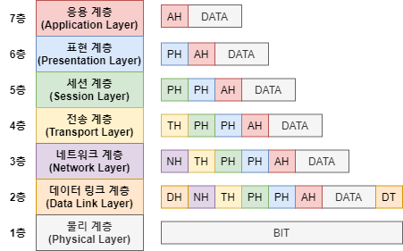

# OSI 7계층

## OSI 모델이란?

**Open Systems Interconnection :**

- 오픈 시스템 상호 연결 모델은 네트워크 통신 기능을 7개의 계층으로 나누는 개념적 프레임워크이다. 

- 국제표준화기구(ISO)에서 제안한 모델이다.

- 다양한 하드웨어/소프트웨어 기술이 어떤 환경에서도 일관되게 작동하게 하기 위해 OSI 데이터 모델은 컴퓨터 네트워킹을 위한 번용 언어를 제공한다.

- 계층별로 모든 기술이 특정 기능을 제공하고 해당 기능을 수행해야 한다. => 프로토콜

- 프로토콜(Protocol) : 데이터를 주고받기 위한 일종의 약속

**추상화(abstraction)**

- OSI 모델은 각각의 계층이 독립적으로 설계되고, 다른 계층과 상호작용할 수 있도록 만들어졌다.

- 상위 계층은 하위 계층의 세부 구현을 몰라도 그 기능을 쉽게 사용할 수 있다.

## 7계층은 왜 나눌까?

통신이 일어나는 과정을 단계별로 알 수 있고, 특정한 곳에 이상이 생기면 그 단계만 수정할 수 있기 때문이다.

- 각 계층은 독립적으로 작용하며 프로토콜에 의해 하위 계층으로 갈수록 헤더가 붙으면서 데이터의 크기가 커진다.

### 1) 물리(Physical)

> 리피터, 케이블, 허브 등
> 
> 프로토콜 : 1000BASE-T, RS-232, RS-485 등

단지 데이터를 전기적인 신호로 변환해서 주고받는 기능을 진행하는 공간

즉, 데이터를 전송하는 역할만 진행한다.

단위는 비트(bit)이며, 통신 케이블의 종류와 신호의 규격 및 무선통신 주파수 설정, 커넥터 형태 등을 정한다.

- 모뎀(Modem) : 동축 케이블의 아날로그 신호를 디지털 데이터로 변환

- 허브(Hub) : 다수의 컴퓨터를 연결하여 하나의 네트워크로 보냄

- 리피터(Repeater) : 디지털 신호를 증폭
  
  - 증폭 많이 하면 법에 걸림

### 2) 데이터 링크(Data Link)

> 브릿지, 스위치 등
> 
> 프로토콜 : 이더넷(Ethernet), PPP, UART 등

물리 계층으로 송수신되는 정보를 관리하여 안전하게 전달되도록 도와주는 역할 -> 네트워크 계층으로 데이터 전달

Mac 주소를 통해 통신한다. 프레임에 Mac 주소를 부여하고 에러검출, 재전송, 흐름제어를 진행한다.

- **이더넷** : 랜에서 데이터를 주고받는 규칙 중 가장 많이 사용된다.

- 프레임(frame) : 데이터 링크 계층의 단위

- MAC주소(Media Access Control Address) : 물리적 주소, 각 기기들을 구분

- 브릿지(Bridge) : 2개의 랜을 연결

- 스위치(Switch) : MAC 주소를 기반으로 데이터를 빠르게 전달

- 랜(LAN, Local Area Network) : 근거리 통신망
  
  - ex) 컴퓨터, 프린터 서버를 연결할 때 사용하는 네트워크

### 3) 네트워크(Network)

> 라우터, IP
> 
> 프로토콜 : IP, ICMP 등

데이터를 목적지까지 가장 안전하고 빠르게 전달하는 기능을 담당한다.

라우터를 통해 이동할 경로를 선택하여 IP 주소를 지정하고, 해당 경로에 따라 패킷을 전달해준다.

라우팅, 흐름 제어, 오류 제어, 세그먼테이션 등을 수행한다.

네트워크를 논리적으로 구분한다.

- 패킷(packet) : 네트워크 계층의 단위

- IP 주소(Internet Protocol Address) : 논리적 주소

- 라우터(Router) : 랜과 인터넷을 연결

### 4) 전송(Transport)

> 프로토콜 : TCP, UDP

TCP와 UDP 프로토콜을 통해 통신을 활성화한다. 포트를 열어두고, 프로그램들이 전송을 할 수 있도록 제공해준다.

- TCP : 신뢰성, 연결지향적
  
  - 세그먼트(Segment) : 데이터 단위
  
  - 세그먼트를 작은 패킷으로 나눠 여러 경로를 통해 데이터를 전달하고 목적지에서 순서대로 조립

- UDP : 비신뢰성, 비연결성, 실시간
  
  - 데이터그램(Datagram) : 데이터 단위
  
  - 순서에 상관없이 데이터를 전달 => 신뢰성 낮음

### 5) 세션(Session)

> API, Socket
> 
> 프로토콜: SSH, TLS, RPC 등

데이터가 통신하기 위한 논리적 연결을 담당한다. TCP/IP 세션을 만들고 없애는 책임을 지니고 있다.

보안과 관련이 크다.

### 6) 표현(Presentation)

> 프로토콜 : JPEG, MPEG, ASCⅡ 등

데이터 표현에 대한 독립성을 제공하고 암호화하는 역할을 담당한다.

파일 인코딩, 명령어를 포장, 압축, 암호화한다.

- Syntax : 정보의 구문
  
  - ex) JSON은 중괄호`{}`로 데이터 구분

- Semantics : 정보의 의미
  
  - ex) `"name": "Alice"`를 이름은 Alice라는 의미로 해석

- Encoding : 인코딩(변환)
  
  - ex) 텍스트 데이터를 컴퓨터가 이해할 수 있는 이진 코드로 변환

- Compression : 데이터 압축
  
  - ex) ZIP 파일

- Cryptography : 암호화
  
  - ex) SSL/TLS 등

- 파일 확장자 txt, jpeg, mp4, html 프로토콜과 관련

### 7) 응용(Application)

> 프로토콜 : HTTP, FTP, DNS 등

최종 목적지로, 응용 프로세스와 직접 관계하여 일반적인 응용 서비스를 수행한다.

사용자 인터페이스, 전자우편, 데이터베이스 관리 등의 서비스를 제공한다.

- HTTP(HyperText Transfer Protocol) : html 문서 전송 프로토콜콜

- FTP(File Transfer Protocol) : 파일 전송 프로토콜

- SMTP(Simple Mail Transfer) : 메일 전송 프로토콜