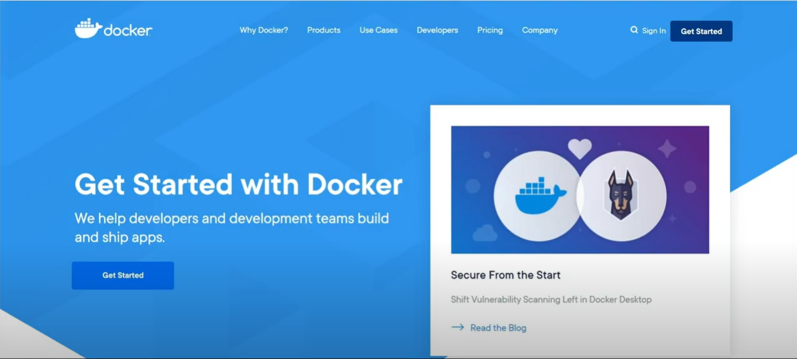
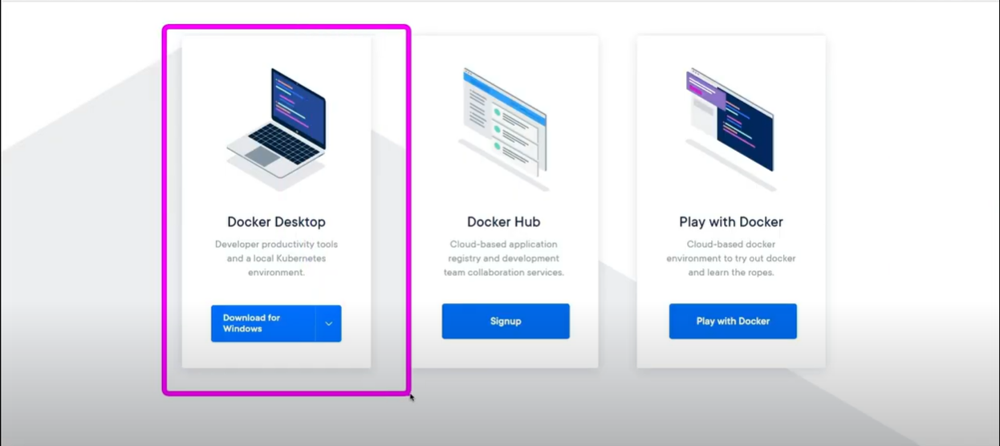

# Docker 학습
## 도커가 무엇이고 왜 쓰는 것일까?
- 도커를 써야하는 이유
  - 한 컴퓨터로 다양한 서버를 구동해야 할 상황이라면?
  - 이미 구축된 서버를 더 좋은 스펙의 컴퓨터로 옮겨야 한다면?

- 도커를 쓴다면?
  - 각 요소들이 설치된 모습을 이미지란 형태로 박제해서 저장
  - 이미지는 DockerHub에 저장되어 관리됨

- 가상컴퓨팅과 다른 점?
  - 가상컴퓨팅은 가상의 os를 깔아서 거기서 구동하기 때문에 성능저하가 발생
  - Docker는 가상 os를 만드는 것이 아닌 한 컴퓨터 내에서 공간(컨테이너)을 나누는 방식이라 부하가 적음

## Docker 사용
### Docker 개요
- 한 집(컴퓨터)에서 여러 입주자들(서버)이 각각 업무를 보는 경우 방(컨테이너)을 나눠 각각의 업무공간을 보장해줌
- 서버 별 개발환경이 다른 경우 한 공간에서 충돌이 일어날 수 있는데 이러한 문제점을 해결할 수 있다.
- 개발자들이 각 컨테이너들이 어떻게 설계되고 지정한 곳에 어떻게 설치가 되고 어떤 업무를 수행할지,\n어떤 컨테이너들이 어떻게 연결되어 함께 서비스를 구성하고 동작할지 설계도(Dockerfile)에 명시할 수 있다.

### Docker 실습
- Docker 설치
  
  - 홈페이지에서 Get Started 선택
  
  - 자신의 OS에 맞는 Docker 파일 설치

- Docker 기본 명령어
  - 도커 버전 확인
  ```bash
    docker -v 
  ```
  - 도커 이미지 다운받기
  ```bash
    docker pull {imageName}:{tag}
    # ex) docker pull python:3, tag는 필수X
  ```
  - 로컬 내 도커 이미지 보기
  ```bash
    docker images
  ```
  - 이미지로 컨테이너 생성하기
  ```bash
    docker create {option} {imageName}:{tag}
    # ex) docker create -it python
  ```
  - 만들어진 컨테이너 시작하기(이미지에 cmd로 지정해놓은 작업 시키기)
  ```bash
    docker start {container id or name}
  ```
  - 컨테이너로 들어가기(컨테이너 내 CLI 사용하기)
  ```bash
    docker attach {container id or name}
  ```
  - 이미지를 다운받아(없을 시) 바로 컨테이너 실행하여 진입하기
  ```bash
    docker run {imageName}:{tag}
    # ex) docker -it run python:3, pull - create - start - attach를 한꺼번에 실행하는 것과 같음
  ```
  - Docker 옵션 설명
  
  | 옵션 | 설명 |
  |:--:|:--|
  |-d|데몬으로 실행(뒤에서 - 안 보이는 곳(백그라운드)에서 알아서 돌라고 하기)|
  |-it|컨테이너로 들어갔을 때 bash로 CLI 입출력을 사용할 수 있도록 해 줍니다.|
  |--name {이름}|컨테이너 이름 지정|
  |-p {호스트의 포트 번호}:{컨테이너의 포트 번호}|호스트와 컨테이너의 포트를 연결합니다.|
  |--rm|컨테이너가 종료되면{내부에서 돌아가는 작업이 끝나면} 컨테이너를 제거합니다.|
  |-v {호스트의 디렉토리}:{컨테이너의 디렉토리}|호스트와 컨테이너의 디렉토리를 연결합니다.|
  - 동작중인 컨테이너 재시작
  ```bash
    docker restart {container id or name}
  ```
  - 도커 컨테이너 내부 쉘에서 빠져나오기(컨테이너 종료)
  ```bash
    exit
    # 또는 Ctrl + D
    # 컨테이너를 종료하지 않고 빠져나오려면 Ctrl + P, Q
  ```
  - 동작중인 컨테이너들 보기
  ```bash
    docker ps
    # 동작중이 아닌 모든 컨테이너들까지 보려면 docker ps -a
  ```
  - 컨테이너 삭제
  ```bash
    docker rm {container id or name}

    # 모든 컨테이너 삭제
    docker rm `docker ps -a -q`
  ```
  - 이미지 삭제
  ```bash
    docker rmi {option} {imageId}
  ```
  - 모든 컨테이너와 이미지 등 도커 요소 중지 및 삭제
  ```bash
    # 모든 컨테이너 중지
    docker stop $(docker ps -aq)

    # 사용되지 않는 모든 도커 요소 삭제
    docker system prune -a
  ```
  - 도커파일로 이미지 생성
  ```bash
    # Dockerfile 파일이 있는 디렉토리 기준. 마지막의 .이 상대주소(현재 폴더)
    docker build -t {imageName} .
  ```
  - 도커 컴포즈 실행
  ```bash
    # docker-compose 파일이 있는 디렉토리 기준
    docker-compose up
  ```
