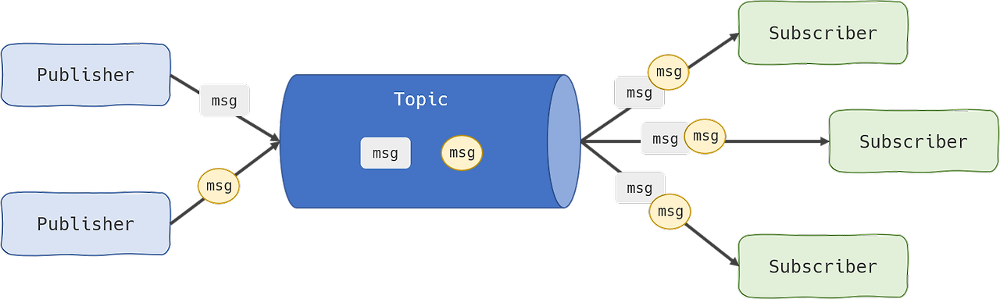

# WebSocket
## 여러 통신 기술
### HTTP
- 웹 통신에서 가장 기본적인 프로토콜
- 클라이언트 --request--> 서버
- 클라이언트 <--response-- 서버
- Connectionless, Stateless한 통신
- 지속적인 업데이트가 필요한 data를 받을 때 계속 통신해야해서 낭비가 심함

### Polling
- 일정한 간격(사용자 설정)으로 서버에 요청을 계속 보내는 것
- Data를 계속 요청해야해서 HttpOverhead가 일어날 수 있음

### Long Polling
- HttpOverhead 발생으로 일어나는 리소스낭비를 방지하기 위해 나온 기술
- 기본적으로는 Polling과 동일, 하지만 업데이트 된 데이터가 없다면 요청을 받았을 때 업데이트 된 데이터가 생길때까지 응답을 보류
- 데이터가 업데이트 되기까지 오랜 시간이 걸린다면(제한시간이 초과될 정도로) 연결이 끊어져 다시 요청을 보내야 함
- 바로 응답을 하지 않는다는 특징 때문에 Hanging GET이라고도 불림

## WebSocket
### 특징
- OSI 7계층에 위치한 프로토콜, 4계층의 TCP에 의존 -> 뭘까 ㅠㅠ
- HTTP와 달리 **전이중** 통신 채널을 사용
  -> 클라이언트와 서버 사이 소켓통신을 유지해 양방향 통신이 가능

### 원리

### 단점
- Low-Level 전송 프로토콜이라 클라이언트와 미리 규약을 정해놓지 않으면 데이터를 라우팅하기 힘들다

## STOMP 통신
### STOMP란
- Streaming Text Origined Messaging Protocol, 순전히 메세징을 위해 탄생한 프로토콜
- 메세지 기반 통신을 제공하고 큐 및 토픽과 같은 메시징 패턴을 사용해 데이터를 전송
- 메세지를 프레임(헤더, 바디)으로 구성하여 전송
- [공식문서](https://stomp.github.io/stomp-specification-1.2.html "stomp 공식문서")

### 원리

- Publisher, 발행, 메세지를 송신하는 쪽          Subscriber, 구독, 메세지를 수신하는 쪽
- 중간에서 서버가 메세지를 받아 처리, 클라이언트는 발행과 구독 역할을 둘 다 지킬 수 있음
- 중간에서 WebSocket 서버가 메세지를 받아 클라이언트로 먼저 보내고 웹서버로 보내는 방식

### 한계
- 웹소켓 서버가 다수가 될 경우 채널 관리가 서버마다 독립적으로 이루어지게 되고 각 서버마다 호환이 어렵다
- 해결방안1: 각 서버에 접속중인 클라이언트 파악, 각 클라이언트가 구독하고 있는 채널 정보 공유
- 해결방안2: 외부 Message Broker 사용

## 외부 Message Broker
**외부 Message Broker 적용 전**

**외부 Message Broker 적용 후**

- 두 가지의 가장 큰 차이점은 STOMP TCP 통신을 통해 message가 외부 Message Broker까지 전달이 됨
- 내부 Broker에서 구독 클라이언트로 메시지를 전송하기 위해 Broker Relay를 사용한다는 것이다.
- 이러한 프로세스를 통해 만약 웹소켓 서버가 여러 개 존재하더라도, 외부 Message Broker를 거쳐서
- 메세지가 전달이 되기 때문에, 정확한 라우팅으로 메세지 송수신이 가능해진다.
- 또한 외부 Message Broker는 Message Queing 방식을 통해 메세지를 처리한다.
