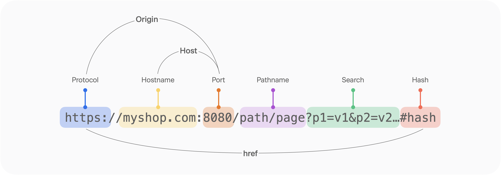

### 학습 배경
웹 프로젝트를 진행하며 서버와 클라이언트가 통신할 때 가장 많이 발생하는 에러가 바로 CORS 에러였다.
이번 공통 프로젝트 과정에서도 주제가 웹디자인 SNS인 만큼 서버와의 통신이 많이 이루어질텐데, CORS 에러가가 많이 발생할 에러라고 판단된다.
지금까지는 해결에만 급급했을 뿐 어떤 배경에서 나온 에러인지 찾아보지 않았는데, 에러의 개념과 배경, 해결 방법을 구체적으로 알아보고자 한다.

# CORS?

Cross-Origin Resource Sharing, 즉 **교차 출처 리소스 공유**는 브라우저가 자신의 출처가 아닌 다른 어떤 출처(도메인, 스킴 혹은 포트)로부터 자원을 로딩하는 것을 허용하도록 서버가 허가 해주는 HTTP 헤더 기반 메커니즘이다.

### 출처가 무엇일까

출처는 Origin의 번역 표현이다.

출처를 구성하는 세 요소는 **프로토콜**, **도메인** (호스트 이름), **포트**인데, 이 중 하나라도 다르면 CORS 에러가 뜨게 된다.



 `https://example.com:8080`에서 클라이언트 스크립트가 실행중이라면

- 프로토콜이 같아야 함 (`https://`)
- 도메인이 같아야 함 (`example.com`)
- 포트가 같아야 함 (`8080`)

CORS를 설정한다는 것은

**출처가 다른 서버 간의 리소스 공유를 허용**한다는 것과 같다.

## CORS 정책이 생긴 이유?

**과거**에는 프론트엔드와 백엔드를 따로 구성하지 않고 한 번에 구성했기에 **같은 도메인 안에서** 처리가 이루어졌다.

→  즉, 다른 출처로 요청을 보내는 게 의심스러운 행위였던 것

그러나 클라이언트에서 API를 직접 호출하는 방식이 대두되며 **클라이언트와 API가 다른 도메인**에 있는 경우가 많게 되었다.

→ 출처가 다르더라도 요청과 응답을 주고받을 수 있도록 **서버에 리소스 호출이 허용된 출처를 명시해주는 방식의 CORS 정책**이 생김

## CORS 요청의 종류

### 1. 단순 요청 (Simple Request)

다음 조건을 모두 만족하면 단순 요청으로 간주되며, 브라우저에서 Preflight 요청 없이 바로 처리된다.

- HTTP 메서드는 GET, POST, HEAD 중 하나
- 요청 헤더는 다음 중 하나만 포함
    - `Accept`
    - `Accept-Language`
    - `Content-Type`

ex)

```jsx
GET /api/data HTTP/1.1
Host: api.example.com
Origin: https://example.com
```

### 2. Preflight 요청(Preflight Request)

단순 요청의 조건을 만족하지 않는 경우, 브라우저는 먼저 Preflight 요청을 보내 서버가 요청을 허용하는지 확인한다

1. **브라우저가 Preflight 요청 전송**

```jsx
OPTIONS /api/data HTTP/1.1
Origin: https://example.com
Access-Control-Request-Method: POST
Access-Control-Request-Headers: Content-Type, Authorization
```

- `Origin`: 요청을 보낸 출처
- `Access-Control-Request-Method`: 클라이언트가 실제 요청에서 사용할 HTTP 메서드
- `Access-Control-Request-Headers`: 클라이언트가 실제 요청에서 사용할 커스텀 헤더

1. **서버가 응답**

```jsx
HTTP/1.1 204 No Content
Access-Control-Allow-Origin: https://example.com
Access-Control-Allow-Methods: POST, GET
Access-Control-Allow-Headers: Content-Type, Authorization
```

- `Access-Control-Allow-Origin`: 허용된 출처
- `Access-Control-Allow-Methods`: 허용된 HTTP 메서드
- `Access-Control-Allow-Headers`: 허용된 요청 헤더

1. **브라우저가 응답 검증 후 실제 요청 전송**

## CORS 작동 방식

CORS는 서버와 클라이언트 간의 HTTP 헤더를 통해 통신하며, 요청과 응답에 다음과 같은 헤더가 포함된다.

1.  **클라이언트 요청 헤더**
- `Origin`: 요청을 보낸 출처를 명시

```jsx
Origin: https://example.com
```

1. **서버 응답 헤더**
- `Access-Control-Allow-Origin`: 특정 출처(또는 모든 출처 `*`)에 대한 접근을 허용

```jsx
Access-Control-Allow-Origin: https://example.com
```

- `Access-Control-Allow-Methods`: 허용할 HTTP 메서드(GET, POST 등)를 명시

```jsx
Access-Control-Allow-Methods: GET, POST
```

- `Access-Control-Allow-Headers`: 클라이언트가 요청 시 사용할 수 있는 헤더를 명시

```jsx
Access-Control-Allow-Headers: Content-Type, Authorization
```

- `Access-Control-Allow-Credentials`: 자격 증명(쿠키, 인증 토큰 등)을 포함한 요청을 허용할지 여부를 결정

```jsx
Access-Control-Allow-Credentials: true
```

## CORS 에러 해결 방법

### 1. 서버 설정

**1.1 @CrossOrigin (특정 컨트롤러나 엔드포인트)**

```java
import org.springframework.web.bind.annotation.CrossOrigin;
import org.springframework.web.bind.annotation.GetMapping;
import org.springframework.web.bind.annotation.RestController;

@RestController
public class ExampleController {

    @CrossOrigin(origins = "https://example.com", // 허용할 출처
                 methods = {RequestMethod.GET, RequestMethod.POST}, // 허용할 메서드
                 allowedHeaders = {"Content-Type", "Authorization"}, // 허용할 헤더
                 allowCredentials = "true") // 쿠키 및 인증정보 허용 여부
    @GetMapping("/api/example")
    public String getExample() {
        return "CORS 설정된 엔드포인트";
    }
}
```

**1.2 WebMvcConfigurer (전역)**

```java
import org.springframework.context.annotation.Configuration;
import org.springframework.web.servlet.config.annotation.CorsRegistry;
import org.springframework.web.servlet.config.annotation.WebMvcConfigurer;

@Configuration
public class WebConfig implements WebMvcConfigurer {

    @Override
    public void addCorsMappings(CorsRegistry registry) {
        registry.addMapping("/**") // 모든 경로에 CORS 설정 적용
                .allowedOrigins("https://example.com") // 허용할 출처
                .allowedMethods("GET", "POST", "PUT", "DELETE") // 허용할 메서드
                .allowedHeaders("Content-Type", "Authorization") // 허용할 헤더
                .allowCredentials(true) // 인증정보 허용 여부
                .maxAge(3600); // Preflight 요청의 캐싱 시간 (초 단위)
    }
}
```

- `addMapping("/**")` : CORS를 적용할 URL 패턴 (예: `/**`는 모든 경로).
- `allowedOrigins(...)` : 허용할 출처(origin)를 지정.
- `allowedMethods(...)` : 허용할 HTTP 메서드를 지정.
- `allowedHeaders(...)` : 클라이언트에서 사용할 수 있는 헤더를 지정.
- `allowCredentials(true)` : 인증 정보(쿠키 등) 포함 여부.
- `maxAge(3600)` : Preflight 요청 결과를 캐시할 시간(초).

**1.3 Spring Security**

```java
import org.springframework.context.annotation.Bean;
import org.springframework.context.annotation.Configuration;
import org.springframework.security.config.annotation.web.builders.HttpSecurity;
import org.springframework.security.config.annotation.web.configuration.EnableWebSecurity;
import org.springframework.security.web.SecurityFilterChain;

@Configuration
@EnableWebSecurity
public class SecurityConfig {

    @Bean
    public SecurityFilterChain filterChain(HttpSecurity http) throws Exception {
        http
            .cors() // CORS 설정 허용
            .and()
            .csrf().disable() // CSRF 비활성화 (필요 시 설정)
            .authorizeRequests()
            .anyRequest().authenticated();

        return http.build();
    }
}
```

### 2. 프록시 서버 사용

개발 환경에서 프록시 서버를 하용하여 CORS 문제를 우회하는 것이다

**2.1 리액트** `package.json`

```json
{
  "proxy": "http://localhost:5000"
}
```

**2.2 리액트 API 요청 작성 시 → 상대 경로 사용**

```jsx
fetch('/api/data')
  .then((response) => response.json())
  .then((data) => console.log(data))
  .catch((error) => console.error(error));
```

### 3. 브라우저 플러그인

크롬의 CORS 관련 플러그인을 임시로 사용하여 테스트할 수 있다