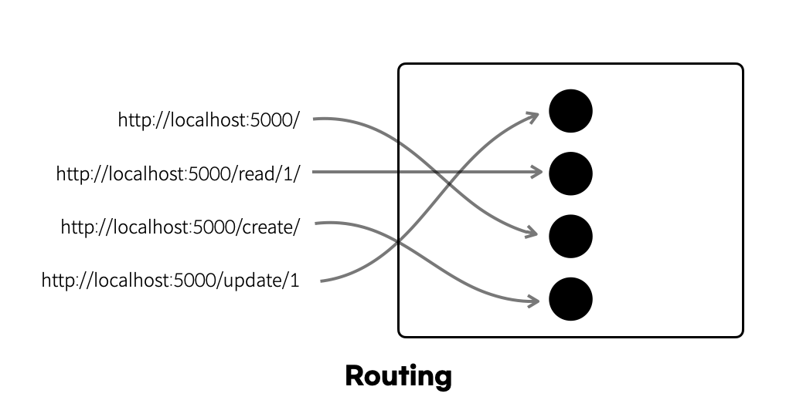

### 학습 배경
이번 프로젝트에서 리액트를 사용한 프론트엔드 개발을 하려고 한다.
프론트엔드 개발 시, 라우터를 잘 활용하는 것이 중요한데, 이전까지 리액트 개발 경험을 되돌아봤을 때 라우터의 다양한 요소를 활용하지 못했다는 점ㅈ에 있어 미흡한 부분이 많았다고 판단된다.
따라서 리액트 라우터의 개념을 확고히 하고, 더욱 완성도 높은 웹 어플리케이션을 개발하고자 공부하게 되었다.

# Routing이란?

네트워크에서 경로를 선택하는 프로세스

즉, 사용자가 요청한 URL에 따라 해당 URL에 맞는 페이지를 보여주는 것이다



# React Router란?

- React 애플리케이션 내에서 페이지 간 이동(라우팅)을 쉽게 구현할 수 있도록 도와주는 라이브러리
- SPA(Single Page Application) 환경에서 페이지가 여러 개인 것처럼 보여주지만, 실제로는 하나의 HTML 파일을 사용하고, JavaScript(React)가 주소(path)에 따라 다른 컴포넌트을 렌더링한다
- 전통적으로 서버에서 라우팅을 처리하여 페이지를 이동하는 방식과 달리, React Router는 클라이언트(브라우저) 측에서 라우팅을 처리한다

## React Router을 사용하는 이유

> 그냥 <a> 태그로 이동하면 안될까?
> 

→ <a> 태그만 사용하면 페이지 전체가 새로 로딩된다. 따라서 화면 깜빡임이 발생하고, 사용자 경험을 떨어뜨리게 된다. SPA 사용자 경험 향상을 위해 라우터를 사용하는 것!!!

> 그렇다면 그냥  SPA 안에서 모든 페이지를 다 렌더링해주는 형식으로 만들면 안될까?
> 

→ 문제가 많다…

예를 들어

1. 특정 페이지 즐겨찾기 등록 불가 -> 화면 전환이 되어도 url 은 고정되어 있기 때문에... 내가 원하는 페이지를 특정할 수 없다.
2. 뒤로가기 불가 -> 마찬가지의 이유. 해당 SPA 하나에 url 하나이기 때문에 뒤로 가기를 누르면 이전에 보던 다른 웹사이트로 이동하게 된다.
3. 새로고침 불가 -> 이 또한 마찬가지! 새로고침을 누를 시 맨 처음의 렌더링 페이지로 이동하게 된다...내가 보던 페이지가 아닌 처음의 페이지가 나온다!

## 라우터 (Router)

- **`BrowserRouter`**
    - 실제 브라우저의 History API를 활용하여 URL을 깔끔하게 유지
        
        (예: `https://example.com/about`)
        
    - 일반적으로 SPA 개발 시 가장 많이 사용

- **`HashRouter`**
    - URL에 `#/about` 형태로 해시(#) 기반의 주소를 사용
    - 브라우저 구형 지원이 필요한 경우 또는 GitHub Pages 등에서 SPA를 배포할 때, 서버 설정을 간소화하기 위해 사용할 수 있다.

- **`MemoryRouter`**
    - 내부적으로 메모리에 히스토리를 저장하는 라우터
    - 브라우저 URL이 실제로 변경되지 않는다.
    - 테스트용 혹은 모바일 앱 내 특정 환경에서 사용

```jsx
import { BrowserRouter } from "react-router-dom";

function App() {
  return (
    <BrowserRouter>
      <Routes>
        <Route path="/" element={<Home />} />
        <Route path="/about" element={<About />} />
      </Routes>
    </BrowserRouter>
  );
}
```

### Routes와 Route

- `<Routes>` 내부에서 `<Route>`를 여러 개 선언함으로써 URL 경로별로 어떤 컴포넌트를 렌더링할지 설정
- `<Route>`에 `path`와 `element` 속성을 주로 사용

```jsx
import { Routes, Route } from "react-router-dom";

<Routes>
  <Route path="/" element={<HomePage />} />
  <Route path="/about" element={<AboutPage />} />
  <Route path="/users/:id" element={<UserDetailPage />} />
  <Route path="*" element={<NotFoundPage />} />
</Routes>
```

### 중첩 라우트와 Outlet

- 중첩 라우트 설정 시 부모 Route의 `element`가 자식 라우트를 렌더링할 공간을 **`<Outlet>`** 컴포넌트로 지정
- 예를 들어, `/users` 경로 아래에서 상세 페이지, 설정 페이지 등 자식 라우트를 구성할 수 있다.

```jsx
// Users.jsx
import { Outlet } from "react-router-dom";

function Users() {
  return (
    <div>
      <h1>Users Page</h1>
      {/* 자식 라우트가 여기에 렌더링 됨 */}
      <Outlet />
    </div>
  );
}

// App.jsx
<Routes>
  <Route path="/" element={<Home />} />
  <Route path="/users" element={<Users />}>
    {/* 중첩 라우트 */}
    <Route path=":id" element={<UserDetail />} />
    <Route path="settings" element={<UserSettings />} />
  </Route>
</Routes>
```

# 라우팅 관련 Hooks

### useNavigate()

- 프로그래밍적으로 이동(페이지 전환)할 때 사용
- `replace`, `state` 파라미터를 통해 브라우저 기록 스택을 교체하거나, 이동 시 상태를 전달할 수 있다.

```jsx
import { useNavigate } from "react-router-dom";

function LoginButton() {
  const navigate = useNavigate();

  const handleLogin = () => {
    // 로그인 검증 로직 ...
    navigate("/dashboard", { replace: true, state: { fromLogin: true } });
  };

  return <button onClick={handleLogin}>로그인</button>;
}
```

### useNavigate()

- URL 파라미터 값을 가져올 때 사용
- 예: `/users/:userId` 경로에서 `userId` 값을 가져옴.

```jsx
import { useParams } from "react-router-dom";

function UserDetail() {
  const { userId } = useParams();
}
```

### useLocation()

- 현재 URL 정보(`pathname`, `search`, `hash`, `state` 등)를 가져올 수 있다
- ex) 네비게이션 바에서, 현재 선택된 옵션 하이라이트 시 사용

```jsx
import { useLocation } from "react-router-dom";

function ShowLocation() {
  const location = useLocation();
  console.log(location.pathname); // 현재 path
  console.log(location.search);   // 쿼리스트링
  console.log(location.state);    // 페이지 이동 시 전달된 state
}
```

### useSearchParams()

- 쿼리 스트링을 조회/수정할 때 사용

```jsx
import { useSearchParams } from "react-router-dom";

function SearchPage() {
  const [searchParams, setSearchParams] = useSearchParams();
  const keyword = searchParams.get("keyword"); // e.g. ?keyword=react
  
  const handleChange = (e) => {
    setSearchParams({ keyword: e.target.value });
  };

  return (
    <div>
      <input value={keyword || ""} onChange={handleChange} />
      <p>검색어: {keyword}</p>
    </div>
  );
}
```

- params란?
    
    ## Params
    
    주소 경로 내부에 특정 데이터를 넣어 전달하는 것
    
    ### **1. url 파라미터**
    
    주소: http://hello.com/new/1234
    
    ```
    <Route path="/new/:id" element={<NewId />} />
    ```
    
    여기에서 `:`으로 구분해준 id라는 값은 파라미터로 전달되어 이후 우리가 NewId 컴포넌트 내부에서 `useParams`훅을 통해 추출하고 사용할 수 있다. 이때 전달된 값은 1234가 된다.
    
    ### **2. 쿼리스트링**
    
    `?, &`을 기준으로 key와 value를 나눠 데이터를 전달받는다. 이렇게 전달 받은 값은 이후 `useLocation`훅을 통해 추출하고 사용할 수 있다.
    
    이전까지는 `?, &`을 직접 분리해 추출해야하는 번거로움이 있었는데, `useSearchParams`를 사용하면 쉽게 해결할 수 있다!!
    
    ### **url 파라미터 VS 쿼리스트링**
    
    | url 파라미터 | 쿼리 스트링 |
    | --- | --- |
    | ID, 이름, 특정 데이터를 조회할때 사용 | 키워드 검색, 페이지네이션, 정렬방식 등 데이터 조회에 필요한 옵션을 전달할 때 사용 |
    | 일반적인 변수, 상수 값들을 전달하기 용이 | key, value 형태의 데이터이므로 json이나 객체 형태의 데이터를 전달하기 용이 |

### Link

- 라우터 내에서 직접적으로 페이지 이동을 하고자 할 때 사용되는 컴포넌트
- html의 <a> 태그와 비슷한 역할을 한다

```jsx
import React from 'react';
import {Link} from 'react-router-dom';

function Nav(){
  return (
    <div>
      <Link to='/'> Home </Link>
      <Link to='/about'> About </Link>
    </div>
  );
}

export default Nav;
```

### NavLink

- <Link>와 거의 동일한 기능을 하지만, 현재 라우트 경로와 일치 여부를 판단하여 스타일 혹은 클래스를 추가할 수 있게 해준다
- ex) 네비게이션 바 구현 시, 현재 선택된 메뉴에 특수한 스타일을 주기 위해 사용한다.

```jsx
<NavLink
  to="/about"
  style={({ isActive }) => ({
    fontWeight: isActive ? "bold" : "normal",
    textDecoration: isActive ? "underline" : "none",
  })}
>
  어바웃
</NavLink>
```

- 이걸 모르던 난 이렇게 했었다...
    
    ```jsx
    const realPriceStyle = location.pathname.startsWith("/realprice_map") && "text-primary-1 ";
    const charterStyle = location.pathname.startsWith("/charters") &&
        !location.pathname.startsWith("/charters/college") && "text-primary-1 ";
    const boardStyle = location.pathname.startsWith("/board") && "text-primary-1 ";
    const dormitoryStyle = (location.pathname.startsWith("/dormitory") ||
          location.pathname.startsWith("/charters/college")) && "text-primary-1 ";
    ```
    

| 구분 | `<Link>` | `<NavLink>` |
| --- | --- | --- |
| 주 사용처 | 일반적인 내부 페이지 이동 | 네비게이션 바 등 **현재 경로에 따라 스타일 변화를 주고 싶을 때** |
| 활성화 여부 | 표시 X | 현재 라우트와 경로가 일치하면 **자동으로 활성화** (스타일 or className 지정 가능) |
| 사용 예시 | `<Link to="/about">어바웃</Link>` | `<NavLink to="/about" style={{...}}>어바웃</NavLink>` |
| 추가 옵션 | 없음 | `style`, `className`, `end`, `isActive` (콜백) 등 |
