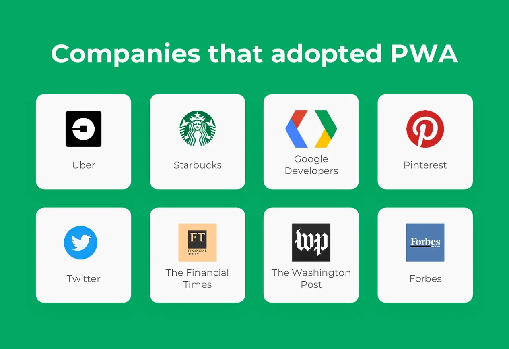

### 학습 배경
이번 프로젝트 기획 과정에서, PC보단 모바일 환경에 더 적합한 서비스라고 생각이 들었다.
따라서 웹앱과 모바일 웹의 차이점을 알아보고, 웹앱의 개발 방법에 대해 알아보고자 한다.

# 웹앱 vs. 모바일 웹

|  | 웹 앱 | 모바일 웹 |
| --- | --- | --- |
| **정의** | 모바일 웹과 비슷하지만 구동방식이 앱처럼 보이게 한 앱 | 모바일 화면에 맞게 구성한 웹 |
| **특징** | > 개발: 웹 개발 방식과 동일 > 실행: 웹 브라우저(SPA) > 겉 모습과 구동방식이 마치 네이티브 같은 웹페이지(모바일 웹보다 모바일에 최적화) | > 개발: 웹 개발 방식과 동일 > 실행: 웹 브라우저(Full Browser)> PC 웹페이지를 모바일에 맞게 줄인 모습 |
| **장점** | > 운영체제 별로 개발할 필요 없음:    비용,시간 절감 / 심사 과정 없음 | > 운영체제 별로 개발할 필요 없음:    비용,시간 절감 / 심사 과정 없음 |
| **단점** | > 디바이스 접근 권한 제한 > 웹 브라우저 검색 또는 URL로 접근해야함(불편) | > 디바이스 접근 권한 제한 > 웹 브라우저 검색 또는 URL로 접근해야함(불편) |

## 풀 브라우저 방식 vs. SPA 방식

| 풀 브라우저 방식 | SPA 방식 |
| --- | --- |
| > 화면 일부분이 변경될 떄 화면 전체를 서버에서 받아옴 > 페이지 Reload 속도가 느림 > 모바일 기기 특성ㄷ상 이동 중 서버 접속 장애 발생할 수 있음 | > 최초 한번 페이지 전체를 받아옴 > 화면 일부분이 변경/ 요청되면 해당 부분만 Ajax를 통해 데이터를 바인딩 함 |

# PWA

PWA는 **프로그레시브 웹 앱**(progressive web app)의 준말로, 웹 기술(HTML, CSS, Javascript)을 가지고 모바일 네이티브 앱과 비슷하게 만들 수 있는 기술을 말한다.

모바일 웹 사이트와 네이티브 앱의 중간 형태로, **모바일 앱과 웹 사이트의 장점을 결합하여 사용자 친화적인 앱 경험을 제공**할 수 있다고 한다.

### 장점

- 빠른 성능을 제공한다.
- 앱 스토어를 거치지 않아도 웹 브라우저에서 바로 앱을 사용할 수 있다.
- 앱 스토어를 거치지 않아도 앱 업데이트가 자동으로 이루어진다.
- 오프라인에서도 작동이 가능하다.
- 검색 엔진 최적화(SEO)에 유리하다.
- 모바일 앱과 웹의 장점을 모두 활용할 수 있다.

### 단점

- 아직 모든 기능이 네이티브 앱과 같지는 않다. OS에서 지원하지 않는 경우 하드웨어 접근이나 네이티브 기능에 대한 제한이 있을 수 있다. 따라서 사용자 경험이 모든 디바이스에서 동일하지 않을 수 있다.
- 브라우저에서 실행되기 때문에 네이티브 앱에 비해서 지연 속도가 크고 배터리 소모량이 더 많을 수 있다.



Pinterest : 전체 모바일 사이트를 PWA로 재구성했다. 핵심 참여자가 60% 증가했으며, 사용자 광고수익도 44% 증가했다.

Tinder : 로딩시간을 11.91초에서 4.69초로 줄였다. PWA는 안드로이드앱보다 90% 작은 크기를 유지한다.

Uber : 2G에서도 빠르게 작동하도록 설계했다. 기본앱은 50k이며, 2G 네트워크에서도 3초이내에 로드 할 수 있다.

- 참고자료 : 
https://blog.wishket.com/%ED%94%84%EB%A1%9C%EA%B7%B8%EB%A0%88%EC%8B%9C%EB%B8%8C-%EC%9B%B9-%EC%95%B1pwa%EC%9D%B4%EB%9E%80-%EB%AC%B4%EC%97%87%EC%9D%B4%EB%A9%B0-%EC%99%9C-%ED%95%84%EC%9A%94%ED%95%9C%EA%B0%80/

# PWA 제작 기술

PWA를 구현하기 위해서는 크게 `manifest.json`과 `ServiceWorkers`라는 2가지의 기술이 필요하다.

## manifest.json

> 앱의 아이콘, 배경색 등을 설정하는 파일
> 

JSON 포맷으로 된 텍스트 파일으로, 웹 애플리케이션에 대한 여러가지 정보들이 담겨있다. 이 manifest를 이용해서 다양한 기기들에 어플리케이션을 설치할 수 있도록 도와준다.

```jsx
{
  "name": "The Zip",
  "short_name": "더집",
  "start_url": "/",
  "display": "standalone",
  "background_color": "#ffffff",
  "theme_color": "#E3C04D",
  "icons": [
    {
      "src": "/icons/icon-192x192.png",
      "sizes": "192x192",
      "type": "image/png"
    },
    {
      "src": "/icons/icon-512x512.png",
      "sizes": "512x512",
      "type": "image/png"
    }
  ]
}
```

## service-workers.js

> PWA의 핵심
> 

PWA는 반응형 디자인, 빠른 속도, 오프라인 기능들이 전제되어야 한다. 서비스 워커는 어플리케이션에서 서버와 데이터를 주고받을때 중간에서 그 모든 요청들을 통제하고 관리할 수 있다.

그래서 어떤 특정한 네트워크 요청과 반응에 한해서 이부분을 따로 저장해둔다면, 나중에 오프라인 상태일때 저장해둔 데이터를 보여줄 수 있다. 또한 최신 뉴스같은 컨텐츠들을 미리미리 저장해놓으면, 사용자가 앱을 키자마자 데이터를 보여줄 수 있으므로 앱의 성능을 높일 수 있다. 이러한 것들은 서비스 워커를 통해서 가능하다!

```jsx
const CACHE_NAME = "thezip-cache-v1";
const urlsToCache = ["/", "/index.html", "/manifest.json"];

self.addEventListener("install", (event) => {
  event.waitUntil(
    caches.open(CACHE_NAME).then((cache) => {
      return cache.addAll(urlsToCache);
    })
  );
});

self.addEventListener("fetch", (event) => {
  event.respondWith(
    caches.match(event.request).then((response) => {
      return response || fetch(event.request);
    })
  );
});

self.addEventListener("activate", (event) => {
  const cacheWhitelist = [CACHE_NAME];
  event.waitUntil(
    caches.keys().then((cacheNames) =>
      Promise.all(
        cacheNames.map((cacheName) => {
```

### 3. **React 프로젝트에 PWA 설정 추가**

React 프로젝트 기준으로 진행:

### (1) CRA 사용 시

- `create-react-app`으로 생성된 프로젝트라면 `react-scripts`가 이미 PWA 설정을 포함하고 있습니다.
- `public/manifest.json` 파일에 PWA 정보를 추가합니다.
- `src/index.js`에서 `serviceWorkerRegistration.js`를 등록:
    
    ```jsx
    javascript
    코드 복사
    import * as serviceWorkerRegistration from './serviceWorkerRegistration';
    serviceWorkerRegistration.register();
    
    ```
    

### (2) Vite 사용 시

- Vite의 경우 `vite-plugin-pwa`를 설치:
    
    ```bash
    bash
    코드 복사
    npm install vite-plugin-pwa
    
    ```
    
- `vite.config.js`에 플러그인 추가:
    
    ```jsx
    javascript
    코드 복사
    import { defineConfig } from 'vite';
    import { VitePWA } from 'vite-plugin-pwa';
    
    export default defineConfig({
      plugins: [
        VitePWA({
          manifest: {
            name: "The Zip",
            short_name: "더집",
            start_url: "/",
            display: "standalone",
            background_color: "#ffffff",
            theme_color: "#E3C04D",
            icons: [
              {
                src: "/icons/icon-192x192.png",
                sizes: "192x192",
                type: "image/png"
              },
              {
                src: "/icons/icon-512x512.png",
                sizes: "512x512",
                type: "image/png"
              }
            ]
          }
        })
      ]
    });
    ```