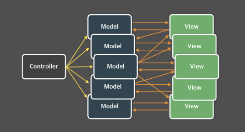
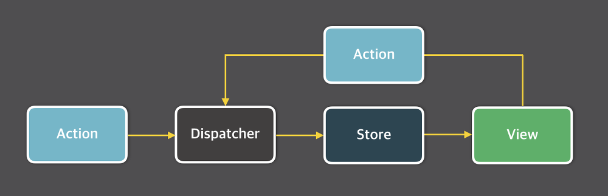

### 학습 배경
프로젝트 진행에 있어 어플리케이션의 상태를 관리하기 위해서는 다양한 상태관리 라이브러리를 활용할 수 있다.
특히, 프론트엔드 리액트의 경우 context api를 사용할 수도 있지만, 더 편리하고 고도화된 어플리케이션 개발을 위해서는 상태관리 라이브러리 사용이 중요하다고 판단된다.
따라서 클라이언트와 서버의 상태관리 라이브러리를 이론적으로 학습하고, 그 차이를 알아보려고 한다.

# Client 상태관리

## Redux

**특징**

- **Flux 아키텍처**를 기반으로 한 단방향 데이터 흐름
- **상태를 전역 스토어**로 관리하며, **액션**과 **리듀서**를 통해 상태 변경
- **Immutable(불변성)** 상태 업데이트 원칙
- **Redux Thunk**, **Redux Saga** 등 미들웨어를 활용해 비동기 로직 처리 가능

<aside>

💡 **MVC 아키텍처**

어플리케이션이 거대해진다면?

❗ **문제점**

사용자와의 상호작용이 View에서 일어났기 때문에 사용자의 입력에 따라 Model을 업데이트 해줘야 하는 경우가 있고 여기서 의존성의 이유로 하나의 모델만이 아닌 다른 모델 까지 업데이트 해야 할 경우도 있을 것이다.

🔜 **단방향 데이터 흐름 !!**

💡 **Flux 아키텍처**

- 단방향 데이터 흐름이라는 것이 가장 큰 특징 !!
- **Dispatcher** : 모든 데이터 흐름을 관리하는 허브
- **Action** : 디스패처의 데이터 묶음
- **Store** : 모든 애플리케이션의 상태를 저장
- **View** : 상태를 가져와 보여주고, 사용자로부터 입력 받을 화면을 보여줌
</aside>

**장점**

1. **예측 가능한 상태 관리**
    
    액션을 통해 상태가 어떻게 변하는지 추적하기 쉽고, 디버깅 및 테스트가 용이
    
2. **풍부한 생태계**
    
    Redux Toolkit, 다양한 미들웨어(Thunk, Saga 등), Redux DevTools 등 서드파티 라이브러리나 확장 기능이 많아 학습 자료와 예제가 풍부
    
3. **명확한 구조** 
    
    Flux 패턴 기반으로 구조가 명료해, 팀 내에서 일정한 코드 컨벤션을 유지하기 유리
    

**단점**

1. **보일러플레이트(Boilerplate) 코드 많음**
    
    액션, 리듀서, 액션 타입 등 여러 파일을 작성해야 하므로 초기에 세팅하기 다소 번거롭습니다. (Redux Toolkit으로 많이 개선됨)
    
2. **코드가 장황해질 수 있음** 
    
    대형 프로젝트에서 리듀서, 액션, 미들웨어 등이 복잡해지며 파일 구조가 방대해질 수 있
    
3. **모듈화 어려움** 
    
    여러 리듀서를 모아 combineReducers를 하긴 하지만, React 컴포넌트 단위로 상태 분리/유지하는 것은 상대적으로 까다로운 편
    

<aside>

💡 **보일러플레이트(boilerplate) 코드**

프로그래밍을 할 때 자주 반복해서 작성하게 되는 틀이나 뼈대 코드
주로 프로젝트를 시작할 때 필수적으로 필요한 설정, 구문 구조, 초기화 로직 등을 미리 정형화하여 반복 작성을 줄이고 개발 생산성을 높이기 위해 활용

예를 들어,

- 웹 프로젝트에서 서버를 구동하기 위해 반복적으로 작성하는 초기 세팅 코드
- 특정 언어/프레임워크에서 HTTP 요청을 처리하기 위한 기본 핸들러 코드
- 객체 지향 언어에서 반복적으로 생성되는 getter, setter 등의 메서드
</aside>

## Recoil

**특징**

- **React 전용** 상태관리 라이브러리
- 페이스북에서 만든 비공식 라이브러리 (아직 공식 버전은 아님)
- **Atoms**, **Selectors** 개념을 통해 **상태(Atom) 단위로 관리**
- React의 **Concurrent Mode(Concurrent Rendering)** 대응을 고려해 설계

<aside>

💡 **Concurrent Mode**

React가 UI를 렌더링할 때 **‘한꺼번에 전부 블로킹하지 않고**, 우선순위를 고려해 **작업을 쪼개어 나눠서** 진행하는 방식

이로 인해 긴 렌더링 작업이 있더라도, **사용자의 입력이나 애니메이션 등 더 중요한 작업을 먼저 처리**하여 **UI가 끊기지 않고 자연스럽게 동작**하도록 해줌

</aside>

**장점**

1. **React 친화적**
    
     Recoil은 React 컴포넌트 트리를 기반으로 하며, Hooks를 통해 상태를 바로 가져올 수 있어 코드가 간결해짐
    
2. **부분 구독**
    
    필요한 Atom을 구독한 컴포넌트만 리렌더링되므로, 불필요한 렌더링을 줄일 수 있음.
    
3. **비동기 처리에 대한 간단한 API 제공** 
    
    `selector`와 `selectorFamily` 등을 이용해 Recoil 내부에서 비동기 로직을 다루기가 비교적 편리
    

**단점**

1. **공식 릴리스 전(Experimental)** 
    
    버전이 아직 완전히 안정되지 않았고, 업데이트에 따라 API 변화 가능성이 있음
    
2. **생태계 미비** 
    
    Redux나 MobX에 비해 사용자 커뮤니티나 자료가 적고, 지원 도구나 미들웨어, 서드파티 라이브러리가 상대적으로 적음
    
3. **학습 필요** 
    
    Atom, Selector, Family, Atom Effect 등 고유 개념을 익히고 최적의 구조를 잡는 데 시간이 걸릴 수 있음
    

## Zustand

**특징**

- **간결하고 최소한의 API**를 제공하는 **Flux** 스타일의 상태관리 라이브러리
- Redux와 달리 **리듀서, 액션** 구조를 강제하지 않음
- **Immer**, **Redux DevTools** 등과 연동이 가능

<aside>

💡 **Immer**

 : JS에서 불변 상태 (Immutable State) 관리를 쉽게 해주는 라이브러리

💡 **Redux DevTools**

 : Redux 상태 변화를 시각적으로 확인하고, 디버깅할 수 있도록 도와주는 브라우저 확장 프로그램

</aside>

**장점**

1. **적은 보일러플레이트** 
    
    useStore라는 hook에서 직접 set 함수를 호출하여 간단히 상태를 업데이트할 수 있으며, Redux에 비해 구조가 유연함
    
2. **범용적 사용 가능** 
    
    React 외에도 Vanilla JS 프로젝트에 사용할 수 있고, 필요한 기능만 선택적으로 이용이 가능
    
3. **크기와 성능** 
    
    라이브러리 자체가 가볍고, 상태를 구독한 부분만 렌더링이 일어나므로 퍼포먼스 최적화가 쉬움
    

**단점**

1. **상태 관리 구조가 자유로움** 
    
    코드를 어떻게 분할하느냐에 따라 가독성과 유지보수성이 갈릴 수 있으며, 팀 내에서 컨벤션을 잘 맞춰야 함
    
2. **커뮤니티 규모** 
    
    Recoil 등 다른 라이브러리 대비 최근 관심이 많아지고 있지만, 여전히 Redux나 MobX 정도로 커뮤니티가 크지는 않음
    
3. **미들웨어/플러그인** 
    
    Redux처럼 다양한 미들웨어 생태계가 있는 것은 아니지만, 현재는 DevTools와 immer, persist 등이 제공되고 있음
    

## MobX

**특징**

- **Observable(관찰 가능한) 상태** 기반으로, 데이터가 변화하면 자동으로 관련 UI가 업데이트
- **반응형(Reactive) 프로그래밍** 패러다임에 가깝게 동작
- 클래스 문법(ES6+) 및 데코레이터(@observable, @action 등) 등을 활용

<aside>

**💡 Observable 상태 기반** 
 : 애플리케이션의 **상태를 관찰 가능한 객체로** 두고, 이 상태가 변할 때마다 자동으로 이를 감지하고, 필요한 로직을 자동으로 실행하도록 구성하는 방식

</aside>

**장점**

1. **쉽게 이해 가능한 반응형 모델** 
    
    observable 데이터가 바뀌면 관련 컴포넌트가 자동 업데이트되어, 별도의 액션을 호출할 필요가 적음
    
2. **보일러플레이트 코드가 적음** 
    
    클래스 혹은 단순 객체에 관찰자를 붙여서 사용하므로, 코드 구조가 직관적일 수 있음
    
3. **유연한 설계** 
    
    Flux 아키텍처를 엄격히 따르지 않아, 비교적 자유롭게 설계할 수 있음
    

**단점**

1. **개념적 복잡성** 
    
    observable, computed, action 등을 이해해야 하며, 코드 흐름이 은밀하게 일어날 수 있어 디버깅이 어렵다는 의견이 있음
    
2. **데코레이터 문법 관련 설정** 
    
    Babel, TypeScript 등을 세팅해야 할 수도 있으며, 공식적으로 자바스크립트 데코레이터 문법이 완전 표준화되지 않은 점이 번거로울 수 있음
    
3. **React와의 결합** 
    
    React에서 MobX를 사용하려면 `mobx-react-lite` 혹은 `mobx-react` 같은 패키지를 추가해야 하며, API 차이를 숙지해야 함
    

## Jotai

**특징**

- **“원자(Atom)”라는 최소한의 단위**로 상태를 관리한다는 점이 Recoil과 유사
- Recoil처럼 **atom**을 정의하고, `useAtom` Hook을 통해 사용하는 구조
- **작고 단순한 API**를 지향

**장점**

1. **간결한 심플 API** 
    
    React Hooks(`useAtom`)만으로 상태를 정의하고 구독하며, 내부 구현은 매우 직관적임
    
2. **Composition(조합)** 
    
    atom을 자유롭게 조합해서 파생 상태를 생성할 수 있고, 코드를 작은 단위로 쉽게 분리할 수 있음
    
3. **Recoil 대비 가벼운 러닝커브** 
    
    selector 등의 개념 없이, atom만으로 상태를 선언하고 조합하면 되므로 구조가 단순
    

**단점**

1. **생태계 제한** 
    
    Jotai 자체적으로는 전용 DevTools나 미들웨어가 적어, 디버깅 도구가 부족할 수 있음 (Jotai DevTools는 별도로 존재하나, 기능이 제한적)
    
2. **컴포넌트가 많아질수록 atom 설계가 중요** 
    
    atom이 많아지면 어디서 어떻게 정의하고 사용해야 할지 복잡도가 올라갈 수 있어, 적절한 구조화가 필요
    
3. **비교적 작은 커뮤니티** 
    
    Zustand나 Recoil처럼 점차 인기가 올라가고 있지만, 아직은 정보가 적은 편
    

| **라이브러리** | **주 사용 방식** | **장점** | **단점** | **사용 추천** 상황 |
| --- | --- | --- | --- | --- |
| **Redux** | Flux 패턴, 리듀서/액션 | 예측 가능한 구조, 풍부한 생태계, 강력한 디버깅 툴 | 보일러플레이트 많음, 코드가 장황해질 수 있음 | 대규모 프로젝트, 체계화된 팀 협업, 풍부한 생태계 활용 시 |
| **Recoil** | Atom/Selector | React 전용, 부분 구독, 비동기 로직 지원 | 아직 공식 버전 전, 생태계 미비, 내부 개념 학습 필요 | React에 특화된 최신 방식, 컴포넌트 단위 관리, Facebook 내부 기술 관심 시 |
| **Zustand** | Hooks 기반 Store | 간단한 API, 적은 보일러플레이트, 유연한 구조 | 구조가 자유로워 팀 컨벤션 필요, 커뮤니티 규모 제한 | 작은~중간 규모 프로젝트, 빠른 개발, 최소한의 상태관리 원하는 경우 |
| **MobX** | Observable 기반 | 자동 반응형 모델, 보일러플레이트 적음, 유연한 설계 | 디버깅 어렵고 마법 같은 동작, 데코레이터 설정 필요 | 반응형 프로그래밍 좋아하는 경우, 클래스 기반 설계 선호 시 |
| **Jotai** | Atom/Hook | 심플한 API, 직관적인 코드, Recoil과 유사하지만 더 가볍고 단순 | DevTools 및 생태계 제한, 많은 atom 설계 시 복잡도 증가 | 프로젝트 규모가 작거나 중간 정도, Light하게 Recoil-like 관리 원하는 경우 |

# **Server 상태 관리**

## React Query

**특징**

- 서버 데이터 캐싱을 통해 **네트워크 요청**을 효율적으로 관리
- Query(읽기), Mutation(쓰기) 개념을 명확히 구분하여 데이터 흐름 관리
- 자동 리패치, **리트라이(재시도)**, 데이터 **Stale Time**, **Cache Time** 설정 등 세부 조정 가능
- 개발 편의를 위한 **DevTools** 제공

**장점**

1. **편리한 비동기 로직 관리** 
    
    `useQuery`, `useMutation`을 통해 fetch 로직, 로딩·에러 상태를 쉽게 핸들링할 수 있음
    
2. **자동 리패치 & 캐싱** 
    
    컴포넌트가 재마운트되거나 화면 전환 후 돌아왔을 때 자동으로 데이터를 업데이트해 줌
    
3. **풍부한 옵션** 
    
    캐싱 전략, 폴링 간격, 의존성(Dependencies) 등에 대한 설정이 세밀하게 가능해, 다양한 요구사항에 대응할 수 있음
    
4. **커뮤니티와 생태계** 
    
    현재 서버 상태 관리 라이브러리 중 가장 활발히 사용되고 있으며, 자료와 사례가 풍부
    

**단점**

1. **상대적으로 무거운 패키지** 
    
    내부 로직이 복잡하고 기능이 많아, 작은 프로젝트에서는 과할 수 있음
    
2. **Redux와 함께 사용할 때** 
    
    이미 Redux를 사용하는 프로젝트에서 React Query를 추가로 도입하면, 상태가 분산되어 관리되는 느낌이 들 수 있어 구조 설계에 주의가 필요함
    
3. **GraphQL 지원은 직접 구현** 
    
    RESTful API 기반으로 설계되었으며, GraphQL 지원을 위해서는 직접 fetch 로직을 작성해야 함ㄷ
    

## SWR

**특징**

- **Next.js** 팀(Vercel)에서 만든 **React**용 데이터 캐싱 라이브러리
- `useSWR` 훅을 통해 데이터 fetch, 캐싱, 리패치 등을 간단히 구현
- “**stale-while-revalidate**” 전략을 적용해, 캐시된 데이터를 먼저 반환 후 백그라운드에서 새 데이터를 가져와 갱신

**장점**

1. **작고 간단한 API** 
    
    `useSWR` 하나로 서버 데이터 로직을 처리하며, 초반 학습량이 적음
    
2. **Opt-in 자동 갱신** 
    
    포커스(브라우저 탭 활성화)나 네트워크 재연결 시 자동으로 재검증(Revalidate)하도록 지원
    
3. **Next.js와 궁합이 좋음** 
    
    SWR을 만든 곳이 Next.js 개발사인 Vercel이기 때문에, Next.js 환경에서 더욱 자연스러운 사용성을 제공
    

**단점**

1. **기능 단순** 
    
    React Query와 비교했을 때 일부 고급 기능(예: DevTools, 세밀한 캐싱 전략, Mutation 관리 등)은 부족할 수 있음
    
2. **별도 DevTools 부족** 
    
    공식적으로 React Query처럼 전용 DevTools가 없으며, 로깅이나 디버깅에 추가적인 툴이 필요할 수 있음
    
3. **GraphQL 지원도 직접 구현** 
    
    REST 대신 GraphQL을 쓰려면 fetch 로직을 직접 작성하거나 별도 클라이언트를 병행해야 함
    

## RTK Query (Redux Toolkit Query)

**특징**

- **Redux Toolkit**에 포함된 서버 상태 관리 솔루션
- Redux와 자연스럽게 통합되어 전역 상태와 서버 상태를 한 곳에서 관리 가능
- `createApi` 함수로 **엔드포인트**(query/mutation) 정의 후 간결하게 데이터 fetch

**장점**

1. **Redux 기반** 
    
    별도의 라이브러리를 추가하지 않고, Redux를 쓰는 프로젝트라면 쉽게 서버 상태 관리를 통합할 수 있음 
    
2. **자동 캐싱 & 리패치** 
    
    엔드포인트별로 캐싱 전략, re-fetch 조건 등을 비교적 간단히 설정 가능
    
3. **통합된 에코시스템** 
    
    Redux DevTools와 연동되고, Redux Thunk/Saga 등과도 잘 호환
    

**단점**

1. **Redux 사용 강제** 
    
    Redux Toolkit 생태계를 따르므로, Redux를 쓰지 않는 프로젝트라면 도입이 번거로움
    
2. **학습 곡선** 
    
    Redux 익숙도에 따라 RTK Query 개념을 이해하는 데 추가 시간이 필요할 수 있음
    
3. **GraphQL 지원 미흡** 
    
    RESTful API 중심으로 설계되었으며, GraphQL 사용 시 설정을 별도로 해줘Re야 함
    

## Relay

**특징**

- **Facebook**이 개발한 **GraphQL 전용** 클라이언트
- 컴파일 타임에 **GraphQL 쿼리를 최적화**하는 방식으로 성능과 확장성에 초점
- “**Relay Modern**”에서는 Fragment Container, Query Renderer 등 React 컴포넌트 구조와 긴밀히 결합

**장점**

1. **GraphQL 퍼포먼스 최적화** 
    
    Relay 컴파일러로 쿼리를 미리 최적화하여 네트워크 트래픽을 줄이고, 서버 응답을 효율적으로 만듦
    
2. **자동 캐싱 및 정합성 관리** 
    
     GraphQL 스키마를 기반으로 캐시를 자동으로 관리하고, 중복되는 요청이나 데이터 정합성을 보장
    

**단점**

1. **GraphQL 전용** 
    
    REST API나 다른 방식의 데이터를 처리하기 어렵습니다. GraphQL 프로젝트가 아니면 사용 불가에 가까움
    
2. **복잡한 설정 & 러닝 커브** 
    
    Relay 컴파일러(바벨 플러그인 등) 설정이 까다롭고, GraphQL 지식이 필수
    
3. **문서 및 커뮤니티** 
    
    Apollo Client에 비해 Relay 사용자의 절대 수가 적고, 다양한 예제나 자료가 상대적으로 부족
    

## Apollo Client

**특징**

- **GraphQL** 클라이언트 라이브러리로, 서버와의 통신, 캐싱, 상태 관리를 모두 제공
- Query, Mutation, Subscription(실시간) 등 GraphQL 전 영역을 지원
- 다양한 **캐싱 전략**(Normalized cache) 및 DevTools 제공

**장점**

1. **풍부한 기능** 
    
    GraphQL 쿼리, 뮤테이션, 서브스크립션을 간단히 구현할 수 있고, 로컬 상태 관리도 가능하게 해줌
    
2. **DevTools & 생태계** 
    
    Apollo DevTools, Apollo Server 등 종합적인 GraphQL 에코시스템을 갖추고 있어 개발 경험이 우수
    
3. **유연한 설계** 
    
    캐시 정책, 에러 핸들링, 리트라이 전략 등을 세밀하게 설정 가능하며, 폴링(Polling)이나 onCompleted 등 다양한 옵션이 있음
    

**단점**

1. **GraphQL 전용** 
    
    Relay와 마찬가지로 GraphQL 프로젝트가 아니라면 도입 가치가 낮음
    
2. **패키지 크기와 복잡도** 
    
    다양한 기능이 한꺼번에 제공되어, 작은 프로젝트엔 과할 수 있고 학습량도 많음
    
3. **Redux + Apollo 동시 사용 시 중복** 
    
    Redux를 병행 사용하는 경우, 전역 상태와 서버 상태의 경계가 모호해질 수 있음

| **라이브러리** | **주요 사용 목적** | **장점** | **단점** | **추천 사용 시나리오** |
| --- | --- | --- | --- | --- |
| **React Query** | REST/Fetch 전용, 범용 | 풍부한 옵션, DevTools, 자동 캐싱·리패치, 커뮤니티 활발 | 기능이 많아 패키지 다소 무거움, Redux 병행 시 분산 관리 이슈 | 다수의 비동기 요청이 필요한 중~대규모 React 프로젝트, RESTful API |
| **SWR** | 가벼운 REST/Fetch | 간단한 API(`useSWR`), 작고 빠름, Next.js와 궁합 | 고급 기능 제한, 전용 DevTools 부족, GraphQL 사용 시 직접 구현 필요 | 소규모·중간 규모 프로젝트, Next.js 활용, 간단한 데이터 fetch·캐싱 |
| **RTK Query** | Redux Toolkit 통합 | Redux DevTools 및 생태계 연동, 자동 캐싱, Redux 기반 통합 관리 | Redux 의존성, GraphQL 사용은 직접 설정 필요 | 이미 Redux 사용 중인 프로젝트, Redux 기반 전역 + 서버 상태 일원화 필요 |
| **Relay** | GraphQL 전용 (Facebook) | 강력한 GraphQL 성능 최적화, 자동 캐싱, React와 깊은 결합 | GraphQL 전용, 설정 복잡, 커뮤니티 제한 | 대규모 GraphQL 서비스, Facebook 방식에 관심이 있는 경우 |
| **Apollo Client** | GraphQL 전용 (Apollo 생태계) | 풍부한 기능(쿼리·뮤테이션·서브스크립션), DevTools, 강력한 캐싱 | 패키지 크기·학습량 많음, GraphQL 미사용 시 불필요 | GraphQL 기반 프로젝트, 서버–클라이언트 사이 복잡한 데이터 상호작용 시 |