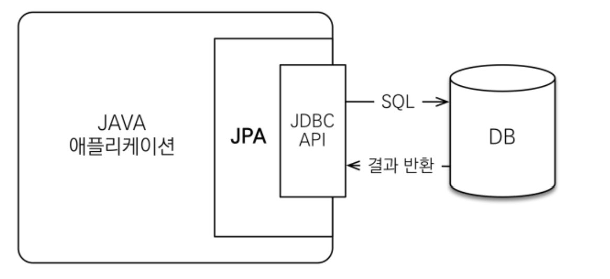
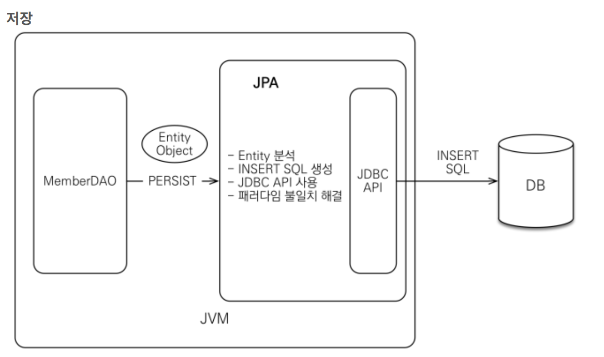
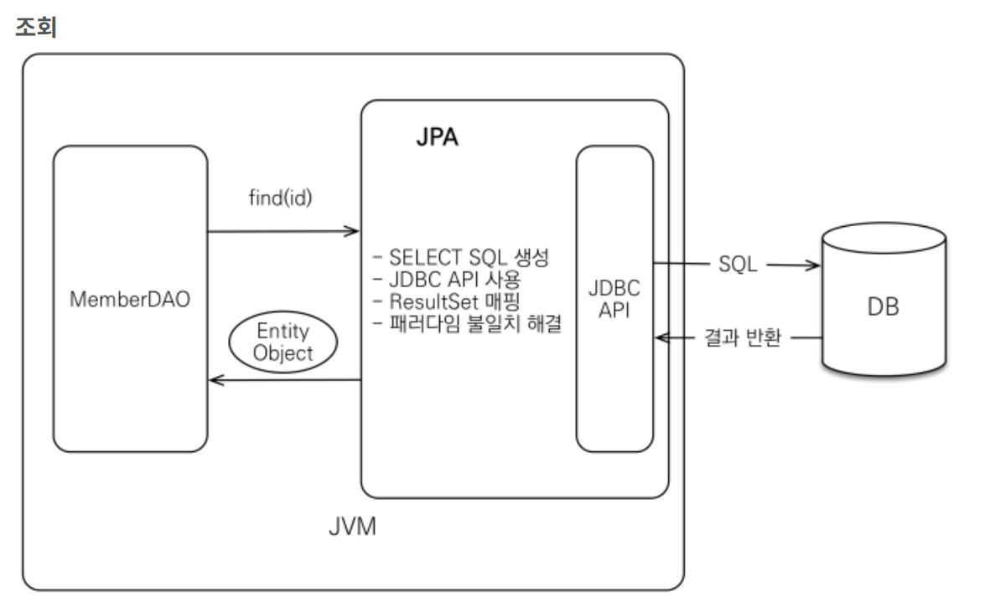

# JPA (Java Persistence API)
- JPA는 자바에서 사용하는 ORM(Object-Relational Mapping) 기술 표준
- JPA는 자바 애플리케이션과 JDBC 사이에서 동작하며, 자바 인터페이스로 정의되어 있다.
 
> ### ORM: Object-Relational Mapping(객체 관계 매핑)
- 객체와 관계형 데이터베이스의 데이터를 매핑하는 기술
- ORM 프레임워크가 객체와 데이터베이스 중간에서 매핑
- 객체와 테이블을 매핑하여 패러다임 불일치 문제를 해결

 

## JPA의 동작

- 애플리케이션과 JDBC 사이에서 동작

- MemberDAO 클래스를 통해 persist()를 실행하면, JPA가 Entity 객체를 분석하여 SQL문을 생성
- JDBC API를 사용하여 DB에 생성된 INSERT SQL을 보내게 됨됨
- 이 과정에서 JPA는 객체와 데이터베이스 테이블의 패러다임 불일치를 해결

- MemberDAO 클래스를 통해 find(id)를 실행하면, JPA는 SELECT SQL을 생성
- JDBC API를 사용하여 생성된 SELECT SQL을 보냄냄
- DB에서 반환된 정보를 ResultSet 매핑을 통해 객체로 변환
- 이 과정에서도 패러다임 불일치 문제를 해결

---

 

## JPA를 사용하는 이유
- JPA를 사용하면 객체 중심 애플리케이션 개발 가능
- 쿼리문을 별도로 작성 X
- 다음과 같이 간단한 메서드를 통해 CRUD
    - 저장 : jpa.persist(member)
    - 조회 : Member member = jpa.find(memberId)
    - 수정 : member.setName(”변경할 이름”)
    - 삭제 : jpa.remove(member)

#### 유지보수
- 기존에는 엔티티 클래스의 필드가 변경되면 모든 SQL을 수정해야 했음
- JPA에서는 쿼리를 직접 작성하지 않기 때문에 필드가 변경되더라도 매핑 정보만 잘 연결하게 되면 자동으로 작성됨

#### 패러다임의 불일치 문제 해결
상속, 연관관계, 객체 그래프 탐색, 비교 등의 설계 차이로 인해 발생하는 패러다임 불일치 문제를 해결

- 객체는 상속 구조를 만들 수 있으며, 다형성 구현이 가능하지만, 관계형 데이터베이스의 테이블은 상속이라는 개념이 존재하지 않음
- 객체는 참조를 통해 관계를 표현하며 방향을 가지고 있으나, 관계형 데이터베이스는 외래 키를 통해 관계를 표현하며, 방향이 존재하지 않음
- 다대다 관계 문제를 해결하기 위해 조인을 사용
- 이 외에도 다양한 패러다임 불일치 문제가 존재
