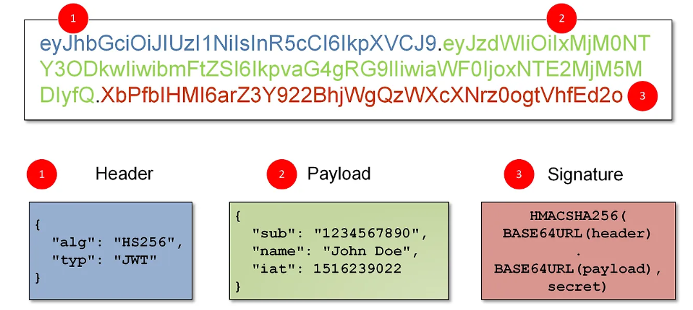

# JWT(Json Web Token)
- JWT는 웹에서 사용되는 JSON 형식의 토큰에 대한 표준 구격
- 사용자의 인증(authentication)과 인가(authorization)정보를 서버 <-> 클라이언트 간 안전하게 주고 받기 위한 방식

### Header
- 토큰의 타입("typ")과 사용된 알고리즘("alg") 정보를 담고 있음 
- 알고리즘느 HS256 이나 RS256과 같은 암호화 방식을 나타냄, 토큰 타입으로는 'JWT'가 일반적으로 사용된다

 

### Payload
- 페이로드는 토큰에 담길 실제 정보(클레임)를 포함
    - 사용자의 정보, 토큰의 유효기간, 발행자 등 다양한 클레임 포함
    - 개발자가 원하는 정보도 직접 추가 가능

 

### Signature
- 서명은 헤더와 페이로드를 합친 후, 비밀키나 공개키/개인키 쌍을사용해 암호화하는 과정을 거쳐 JWT의 무결성과 인증을 보장함

 

-----

 

## JWT 인증 흐름

> **로그인 프로세스**  
> 로그인 요청 -> 서버에서 사용자 인증 -> JWT 토큰 생성 -> 서버 응답 -> 클라이언트

- Spring Security의 보안 컨텍스트란?
-  Spring Security에서 사용자의 인증 및 권한 정보를 저장하고 사용하는 데 사용되는 클래스
- ThreadLocal에 저장

### RTR (Refresh Token Rotation)
- Access Token이 만료될 때마다 Refresh Token도 함께 교체하는 보안 강화 방식
- 기존 Refresh Token을 일회성으로 만들어 재사용을 방지
> 작동 방식
1. 클라이언트가 Refresh Token으로 새 Access Token 요청
2. 서버는 새로운 Access Token과 Refresh Token 모두 발급
3. 기존 Refresh Token은 즉시 무효화
4. 새 토큰들을 클라이언트에 전달

### Redis와 RDBMS 장단점
#### Redis
**장점**
- 빠른 액세스 속도로 토큰 재발급 시 병목 현상 방지
- TTL(Time-To-Live) 기능으로 만료된 토큰 자동 삭제
- 메모리 기반으로 토큰 조회/갱신이 빠름
- 대규모 트래픽 처리에 유리

 

**단점**
- 메모리 기반이라 서버 장애 시 데이터 손실 가능
- 메모리 비용이 상대적으로 높음
- 영구 저장이 필요한 데이터에는 부적합

#### RDBMS
**장점**
- 데이터 영구 보존 가능
- 데이터 안정성이 높음
- 다른 데이터와 관계 설정 가능
- 트랜잭션 관리가 용이

 

**단점**
- 토큰 만료 처리를 위한 별도 스케줄러 필요
- 상대적으로 느린 조회 속도
- 데이터베이스 부하 증가
- 토큰 관리의 복잡성 증가

 

---

## 고려사항
> ### LocalStorage
**장점**
- CSRF 공격에 안전
- JavaScript에서 쉽게 접근 가능
- 큰 저장 용량 (5-10MB)
- 서버로 자동 전송되지 않아 네트워크 부하 감소
- 서드파티 API 사용 시 유용

 

**단점**
- XSS 공격에 매우 취약
- JavaScript로 쉽게 접근 가능하여 토큰 탈취 위험
- 보안에 취약한 저장 방식

 

> ### HttpOnly Cookie
**장점**
- XSS 공격 방지 (JavaScript로 접근 불가)
- 자동으로 요청에 포함되어 관리 용이
- HttpOnly 옵션으로 보안 강화
- 토큰 관리가 상대적으로 안전

 

**단점**
- CSRF 공격에 취약
- 서버 로직이 복잡해질 수 있음
- 쿠키 관리에 추가적인 신경 필요
- 저장 용량 제한
